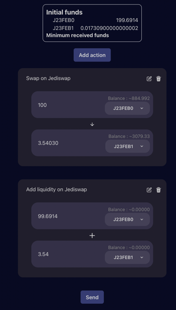

# :icon-stack:  Combos 
Customize your transactions with an easy drag-and-drop mechanism

## DeFi Protocols we support on Starknet

| Decentralized Exchanges                         |
|-------------------------------------------------|
| [Jediswap]( https://app.testnet.jediswap.xyz/)  |
| [Myswap](https://www.myswap.xyz/)               |

Starcombo is a tool allowing users to build their DeFi strategy on Starknet simply by drag&drop.

When creating a __combo__, users can access multiple DeFi protocols and select which action they want to do.
Users will then need to fill in the required inputs, and Starcombo will bundle them into a _combo_, which is a single transaction
sent on the Starknet network.

## How do I create a combo? 

To create a combo, you will need to add multiple blocks. Each block represents an action within a DeFi protocol, such as providing or removing liquidity or swapping tokens.
Once you have multiple blocks and you have locked them, you can re-order the block as you wish.

For example, this is a strategy that swaps 100 J23FEB0 tokens to 3.54 J23FEB1 tokens on Jediswap, and then uses the output of this first operation as an input to the _add liquidity_ operation.

I can easily modify this strategy by adding a block and re-ordering them with a simple drag&drop.