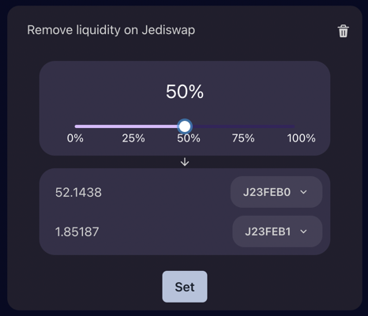

# Removing liquidity

## How can I remove liquidity from a pool?

To do so, you'll need to navigate to the combos page and click the :icon-plus-circle:sign to add an interaction.
From there, you'll be able to select the protocol from where you want to remove liquidity.

Clicking on _Remove Liquidity_ will add a block to the list. You can select the tokens you wish to provide liquidity for and press "Set" when you're done.
