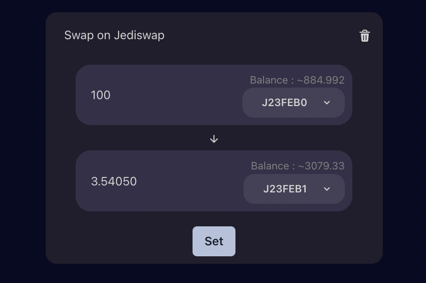

# Swaps

## How can I perform a swap?

Currently, you can use both [Jediswap](https://app.testnet.jediswap.xyz/) and [Myswap](https://www.myswap.xyz/) to swap tokens on Starknet.

To do so, you'll need to navigate to the combos page and click the :icon-plus-circle: sign to add an interaction.
From there, you'll be able to select the protocol to use for a swap.

Clicking on _swap_ will add a block to the list. You can then input the token and amount to swap, and press "Set" when you're done.

## Can I perform multiple swaps ? 

You can perform as many swaps as you'd like in a single transaction.